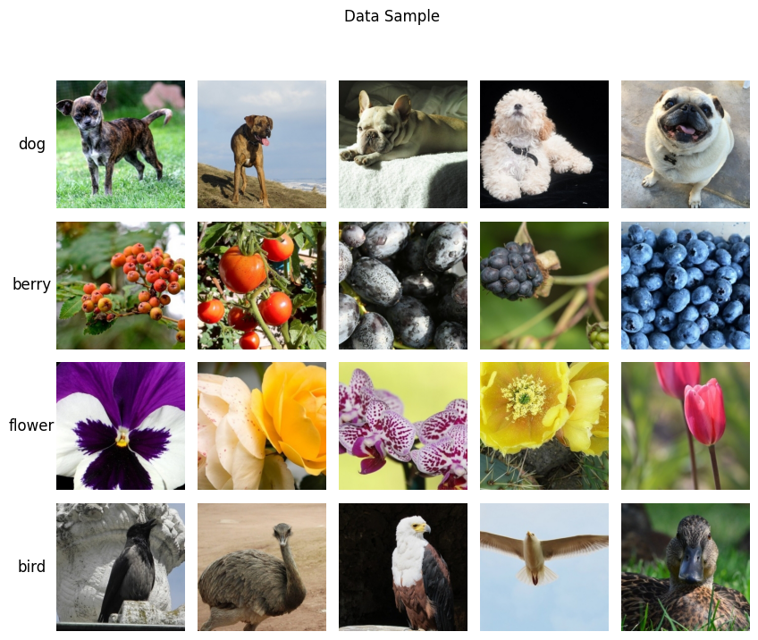
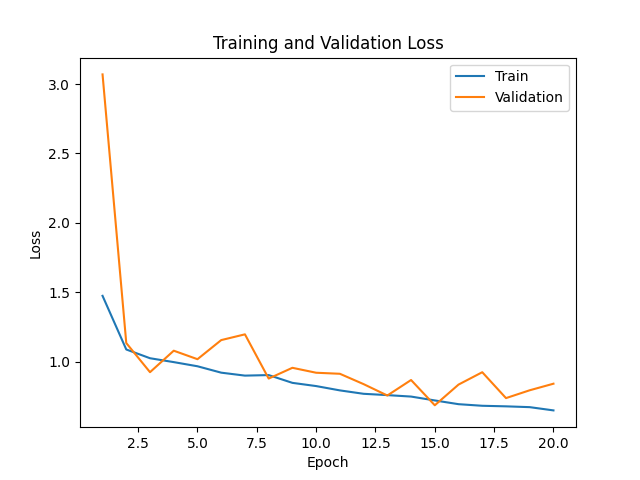
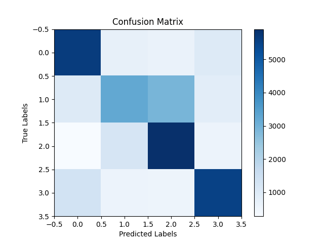

# Sample Dataset:

# Training and Validation Accuracy:

# Training and Validation Loss:

# Confusion Matrix:

# The Model is not overfitted:
1.	First of all, we can say a Model is overfitted when the training loss continues to decrease while the validation loss starts to increase or remains same. For the Training Step image we can see that for both training and validation, the loss are decreasing. So we can assure that the model is not overfitted.
2.	If we have a look at the training and validation accuracy we can see that the training accuracy is increasing for every epoch and the validation accuracy is also increasing. And also, the difference between training and validation accuracy is not very high. So we can say that the model is not overfitted.
